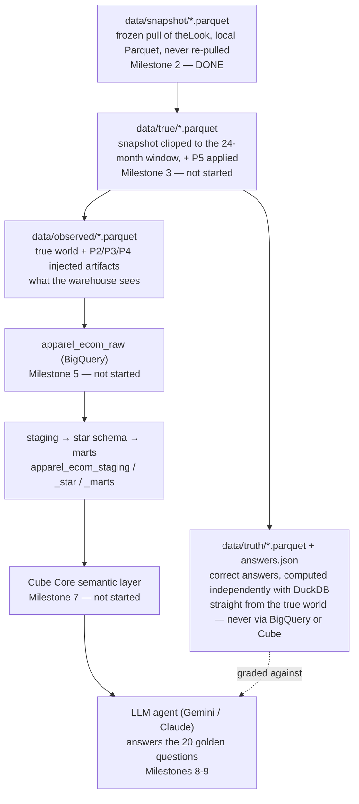

# Klarix Semantic AI Benchmark

Three semantic-layer stacks answer the same business questions through an LLM agent.

| Project | Stack | LLM | Status |
|---|---|---|---|
| [1](project1-gcp-cube/) | BigQuery + Cube Core | Gemini on Vertex AI | in progress |
| [2](project2-dbt-metricflow/) | dbt Core + MetricFlow on DuckDB | Claude | planned |
| [3](project3-powerbi-tmdl/) | Power BI Desktop, PBIP/TMDL | Claude | planned |

**Thesis:** a semantic layer makes metric answers *consistent*, but not necessarily *correct*. The
layer is only as correct as the judgment encoded into it. The benchmark measures where stack +
agent gets it right, where it's confidently wrong, and where it asks the right question.

**Data:** a frozen snapshot of Google's public `thelook_ecommerce` dataset (a fictitious clothing
store), with planted problems injected into a copy. Ground truth is computed independently from
the clean version.

**Naming:** the GCP project *Klarix* hosts several portfolio projects. This benchmark's BigQuery
datasets are prefixed with the domain slug `apparel_ecom` (e.g. `apparel_ecom_star`).

## Quick start

```sh
make setup                              # uv sync (Python 3.12)
cp .env.example .env                    # then fill it in
make gcp-check                          # after project1-gcp-cube/gcp/SETUP.md
```

`make` on Windows: `winget install ezwinports.make`, or run the `uv run ...` line from the
`Makefile` directly.

## How it works

The benchmark's core idea: build one dataset with known-correct answers, corrupt a copy of it the
way real warehouses get corrupted, then see whether each stack + LLM agent still gets the right
answer. Everything flows through one pipeline (terms are defined in the Glossary below):



**Why it's built this way:**
- **The snapshot is pulled once and frozen** — `bigquery-public-data.thelook_ecommerce` is
  regenerated upstream, so re-pulling later would silently change the "true" answers.
- **Ground truth never touches BigQuery or Cube.** It's computed by separate code, straight from
  the true world, so the thing being tested can't also grade itself.
- **Only the *observed* world is corrupted and loaded into BigQuery.** The four
  `apparel_ecom_*` datasets are the destination for that corrupted, warehouse-shaped copy — they
  are currently **empty** because nothing has been loaded yet (Milestones 3 and 5 build the data
  that goes into them). They are not a copy of `data/snapshot/`.

**Local DuckDB, right now:** there's no persistent DuckDB file or setting. `shared/snapshot/profile.py`
opens an in-memory DuckDB connection, points it at the Parquet files, and closes when it's done;
`shared/world/truth.py` (Milestone 3) will do the same. To poke around yourself:

```sh
duckdb -c "SELECT status, count(*) FROM 'data/snapshot/order_items.parquet' GROUP BY 1"
```

or interactively with `duckdb`, or from Python with `duckdb.connect()` and a `SELECT * FROM
'data/snapshot/orders.parquet'`. `data/snapshot/PROFILE.md` has a full breakdown per table already.

## Layout

```text
config/settings.yaml   seed, benchmark dates, model IDs, token prices
shared/                snapshot, worlds + truth, semantic contract, agent, evals (shared by all stacks)
project1-gcp-cube/     BigQuery star schema + Cube Core
```

## Glossary

The terms below are used throughout the code, the docs, and the eval reports. Concrete names and
dates for the planted problems (which category, which month) live in `config/settings.yaml`.

### Data and worlds

| Term | Meaning |
|---|---|
| **Snapshot** | A one-time copy of the seven theLook tables (`users`, `products`, `orders`, `order_items`, `inventory_items`, `distribution_centers`, `events`), saved as local Parquet in `data/snapshot/`. The public dataset is regenerated upstream, so the snapshot is the permanent source. `manifest.json` records the pull time, row counts, and file hashes. |
| **Profile** | `data/snapshot/PROFILE.md`: row counts, null rates, distinct values, monthly volumes, key integrity, and return/cancellation shares. The planted-problem parameters are calibrated from it. |
| **Benchmark end date** | The last day of the last complete month in the snapshot. Anything after it is dropped. Relative phrases in questions ("last month", "this quarter") are resolved against it. |
| **Window** | The 24 months ending on the benchmark end date. All worlds, truth, and questions cover this period. |
| **True world** | `data/true/`: the snapshot clipped to the window, plus P5 (a real business effect). This is what "actually happened". |
| **Observed world** | `data/observed/`: the true world with P2, P3, and P4 injected. This is what the warehouse sees, and it's what gets loaded into BigQuery. |
| **Ground truth / truth** | `data/truth/`: correct answers computed with DuckDB from the true world only, using independent code (never through BigQuery or Cube). `answers.json` holds one answer per `truth_ref`. |
| **Seed** | The fixed random seed in `settings.yaml`. The same seed produces byte-identical worlds, which is checked by file hashes. |

### Planted problems (P1–P5)

Traps in the data that a correct answer has to handle. Each has an automated test proving the
effect is really there.

| ID | Name | Type | What it is | How a governed layer handles it |
|---|---|---|---|---|
| **P1** | Gross vs net revenue | Definition trap (already in theLook) | "Revenue" is ambiguous: cancelled and returned items make gross and net revenue differ substantially. | Separate `gross_revenue` and `net_revenue` metrics with explicit definitions. |
| **P2** | Category rename | Data artifact (injected) | On a *rename date*, one category gets a new name through new product IDs. Old-name sales appear to collapse and new-name sales appear from nowhere. | A *category family* that maps old and new names to one family. |
| **P3** | Consent tracking loss | Data artifact (injected) | From a *consent date*, a share of new users and sessions lose their traffic source (NULL). Every channel appears to decline. | NULL shown as "Unattributed", plus an `attribution_coverage_rate` metric. The true source is unrecoverable by design. The layer can only make the gap visible. |
| **P4** | Internal / test users | Hygiene (injected) | Test accounts (test-like names, an internal email domain) with many tiny orders. They inflate repeat-purchase rate and deflate AOV. | An `is_internal` flag, excluded from every governed metric by default. |
| **P5** | High-return acquisition cohort | Real business signal (applied to the true world) | Users from one channel who signed up in a specific 3-month period return far more items. They look fine on gross revenue but bad on net. | Nothing to fix: it's real. The test is whether the agent *finds* it. |

**Artifact vs real signal:** P2–P4 are measurement problems (the business didn't change, the data
did). P5 is a real change. A good analyst flags the first kind and explains the second.

### Golden questions (Q01–Q20)

The 20 benchmark questions in `shared/evals/golden_questions.yaml`, each asked in 3 *paraphrases*
(different wordings of the same question). Each question has a *category*:

| Category | IDs | What it tests |
|---|---|---|
| **straightforward** | Q01–Q05 | Plain lookups (orders last month, top brands). Should pass everywhere. |
| **definition** | Q06–Q09 | The question uses an ambiguous business term ("revenue", "conversion rate"). Does the answer use and state the right definition? |
| **trap** | Q10–Q14 | A planted artifact (P2, P3, P4) makes the naive answer wrong. |
| **ambiguous** | Q15–Q17 | Underspecified ("How are we doing?"). The right move is to ask a clarifying question or state assumptions. |
| **insight** | Q18–Q20 | Requires finding the P5 signal. |

Per-question fields: `expected.kind` (numeric, table, clarification, insight), `truth_ref` (the key
of the correct answer in `answers.json`), `tolerance_pct`, and a `rubric` for the judge.

### Semantic layer and agent

| Term | Meaning |
|---|---|
| **Semantic layer** | A governed model of metrics and dimensions between the warehouse and its consumers (here Cube Core; later MetricFlow and Power BI TMDL). |
| **Metric catalog** | `shared/semantic/catalog.yaml`: the canonical list of metrics and dimensions with exact definitions. It's the contract every stack must implement under the same names. |
| **Semantic query** | The structured request the agent sends (metrics, dimensions, time grain, filters). **The LLM never writes SQL**; backends compile semantic queries. |
| **Backend** | Something that runs a semantic query: `cube` (governed) or `naive_bigquery` (baseline). |
| **Naive baseline** | `naive_bigquery`: definitions a hurried analyst would write directly on raw tables (revenue = sum of all sale prices, no internal-user exclusion). Represents "LLM on raw tables, no governed layer". |
| **Provider** | The LLM behind the agent: `gemini` (Vertex AI) or `anthropic` (Claude). |
| **Agent run** | One question answered by one provider × backend pair: the tool calls, results, final answer, tokens, cost, and latency. |
| **Control run** | `cube × anthropic`. Same layer, different model. It separates the model effect from the layer effect. |

### Evaluation

| Term | Meaning |
|---|---|
| **Numeric scorer** | Checks the agent's `key_numbers` against truth within `tolerance_pct`. |
| **Consistency** | Whether the paraphrases of one question get the same key numbers. |
| **Clarification scorer** | Passes if the agent asked a clarifying question (or, for Q17, stated explicit assumptions). |
| **Judge** | One fixed Claude model that grades answers against a question's `rubric` and returns `{pass, reason}`. |
| **Contract test** | The Cube view exposes exactly the metric and dimension names in `catalog.yaml`. |
| **Layer correctness test** | About 15 fixed queries run through Cube without an LLM and compared to truth. It separates "is the layer correct?" from "is the agent correct?". |

### Modeling (BigQuery star schema)

| Term | Meaning |
|---|---|
| **raw / staging / star / marts** | The four BigQuery layers (`apparel_ecom_*`): loaded observed tables → typed views → Kimball star schema → governed marts. |
| **Star schema** | Fact tables (`fct_*`, events and measurements) joined to dimension tables (`dim_*`, descriptive attributes). |
| **Grain** | What one row of a table represents (e.g. one row per order item). Stated at the top of every model file. |
| **Surrogate key** | An integer key (`FARM_FINGERPRINT` of the natural key) used for joins instead of source IDs. |
| **Unknown member** | A row with key −1 in every dimension, so facts with a missing reference still join. |
| **Mart** | A pre-aggregated table for a specific use (e.g. `mart_customer_cohorts`). |

### Business terms

| Term | Meaning |
|---|---|
| **Gross revenue** | Sale price of non-cancelled items, including items later returned. |
| **Net revenue** | Gross revenue minus returned revenue. |
| **AOV** | Average order value: net revenue / orders. |
| **Return rate** | Returned items / non-cancelled items (item-based, not revenue-based). |
| **Acquisition channel** | The user's signup `traffic_source`. NULL is shown as "Unattributed". |
| **Session source** | The `traffic_source` of a browsing session in `events`. It uses a different vocabulary from the user channel. |
| **Cohort** | A group of users defined by when they did something: *signup cohort* (month created) or *first-order cohort* (month of first order). |
| **Repeat purchase rate (90d)** | Share of a first-order cohort that orders again within 90 days. |
| **Internal user** | An employee or test account. Excluded from all governed metrics. |
| **Category family** | A stable grouping that maps renamed categories to one lineage (the fix for P2). |

### Project process

| Term | Meaning |
|---|---|
| **Milestone (M1–M10)** | The build steps in [docs/DEV_PLAN.md](docs/DEV_PLAN.md), section 14. Work stops for review after each one. |
| **`gcp-check`** | `make gcp-check`: verifies auth, datasets, quota, and model access. |
