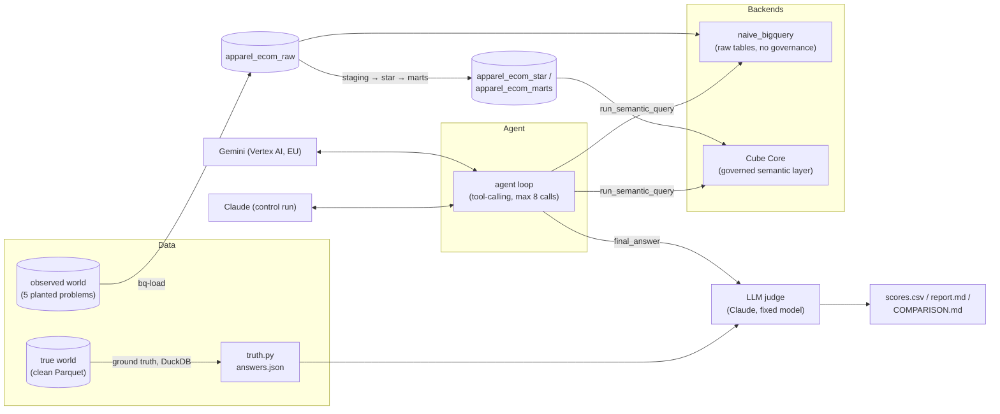
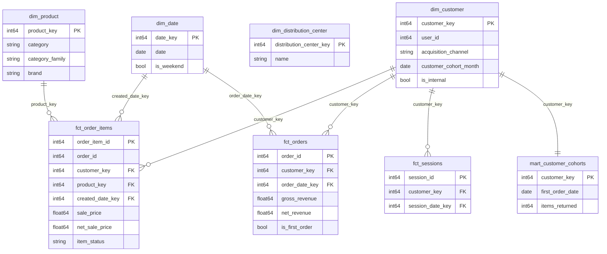

# Project 1: BigQuery + Cube Core, evaluated by a Gemini agent

**Part 1 of 3** in the Klarix Semantic AI Benchmark — a portfolio project comparing
three semantic-layer stacks (BigQuery + Cube Core, dbt Core + MetricFlow, Power BI)
answering the same business questions through an LLM agent, on the same frozen,
intentionally-flawed dataset.

**Thesis:** a semantic layer makes metric answers *consistent*, but not necessarily
*correct*. The layer is only as correct as the judgment encoded into it. This
benchmark measures where a stack + agent gets it right, where it is **confidently
wrong**, and where it asks the right question instead of guessing.

## The setup

A frozen snapshot of Google's public `thelook_ecommerce` dataset (a fictitious D2C
apparel store) is copied twice: a clean **true** version, and an **observed** version
with five planted data-quality problems injected into it. Ground truth is computed
independently from the clean version with DuckDB — never through BigQuery or Cube.
An LLM agent (Gemini or Claude) answers 20 fixed business questions against the
*observed* data through one of two backends, and every answer is scored against the
true ground truth.

The agent never writes SQL. It calls `list_metrics`, `list_dimensions`, and
`run_semantic_query` against a shared contract (metrics/dimensions by name, a time
range, filters, a limit); each backend compiles that contract into whatever it
needs — hand-written SQL for `naive_bigquery`, a Cube query for `cube`.

## Star schema (BigQuery)

`fct_orders` keeps fully-cancelled orders as rows (`gross_revenue = 0`) rather than
dropping them, so "how many orders" always has one unambiguous denominator.

## How each planted problem is handled

| # | Problem | Handled by design? | Where |
|---|---|---|---|
| **P1** | "Revenue" is ambiguous (gross includes cancelled/returned items; net doesn't) | Deliberately **not** resolved — both metrics exist, named separately, as a test of whether the agent notices the split or quietly picks one | `fct_order_items`: `sale_price` vs `net_sale_price` |
| **P2** | A category is renamed mid-window (Sweaters → Knitwear) | Yes — a governed, hand-maintained mapping table assigns both names to one stable `category_family`, so the rename is invisible downstream | `map_category_family` (dim_product) |
| **P3** | Consent loss nulls out acquisition channel for some users | Yes — nulls are coalesced to an explicit `"Unattributed"` value rather than silently dropped or left as NULL | `dim_customer.acquisition_channel` |
| **P4** | Synthetic internal/test accounts inflate order counts and distort repeat-purchase rate | Yes, **only on the governed path** — `is_internal` is a rule (email domain or name-prefix match), and the governed view excludes it by default. `naive_bigquery` has no such flag; it structurally cannot exclude these accounts | `dim_customer.is_internal`, Cube's `commerce` view |
| **P5** | A real but small acquisition cohort has sharply higher return/repeat behavior, invisible at the whole-channel level | Yes, structurally — a dedicated cohort mart exists so the question can be asked at cohort grain, not just channel grain. The agent still has to *choose* to scope it there | `mart_customer_cohorts` |

## One concrete example

Q01, "How many orders did we have last month?" — ground truth: **4,633**.

| Backend | Answer | What happened |
|---|---|---|
| `naive_bigquery` | **5,898** | 27% over truth. The agent noticed a real anomaly (order volume on the last day of the month looked too low) and confidently attributed the discrepancy to *that*, rather than to the internal/test accounts it has no way to see or exclude — a textbook "confidently wrong" answer. |
| `cube` | **4,495** | 3% off truth, in the other direction (this question's numeric tolerance doesn't gate pass/fail for this reason — see Limitations). The agent's own stated definition explicitly says *"excludes test/internal customer accounts"*, because that exclusion is built into the governed view, not something the agent had to reason its way into. |

Neither backend hit the ground truth exactly, but the qualitative difference is the
point: one stack's agent *could not have known* about the data problem it was being
tested on; the other's definition carried the fix by construction.

## Eval results

Three required runs (DEV_PLAN section 12.4), 20 golden questions × 3 paraphrases
each, one fixed Claude judge model across all three so the comparison is about the
stack, not the grader.

| Run | Pass rate |
|---|---|
| `naive_bigquery` × Gemini (baseline) | 40% (8/20) |
| `cube` × Gemini (headline) | 45% (9/20) |
| `cube` × Claude (control) | 30% (6/20) |

**By category:**

| Category | naive × gemini | cube × gemini | cube × anthropic |
|---|---|---|---|
| straightforward | 60% | 60% | 60% |
| definition | 25% | 25% | 25% |
| trap | 60% | 60% | 40% |
| ambiguous | 33% | 33% | 0% |
| insight | 0% | 33% | 0% |

**By planted problem:**

| Problem | naive × gemini | cube × gemini | cube × anthropic |
|---|---|---|---|
| P1 (gross/net ambiguity) | 50% | 50% | 0% |
| P2 (category rename) | 50% | 50% | 0% |
| P3 (consent loss) | 100% | 100% | 100% |
| P4 (internal accounts) | 60% | 40% | 20% |
| P5 (cohort return rate) | 0% | 33% | 0% |

Full per-question tables and the cost/latency breakdown are in `runs/COMPARISON.md`.

## Privacy

The agent receives schema metadata and aggregated query results only, never raw
rows. Gemini runs on Vertex AI in an EU region inside this project's own GCP
boundary. Vertex AI does not use customer prompts to train models (verify current
Google Cloud terms before publishing externally). The underlying data is
Google's public, synthetic `thelook_ecommerce` dataset — no real customer data at
any point.

## What to screen-record

1. `make world` — the deterministic true/observed/truth pipeline running end to end.
2. `make bq-build && make bq-test` — staging → star → marts, all 16 SQL assertions passing.
3. `make cube-up && make cube-test` — Cube container coming up, contract + layer
   correctness tests passing against live BigQuery.
4. The Q01 example above, live: same question, both backends, side by side —
   `naive_bigquery` confidently misdiagnosing the internal-account inflation,
   `cube` excluding it by construction.
5. Q10 (the category-rename trap, "How has Knitwear performed over the last 12
   months?") across all three paraphrases on both backends: Cube answers it
   correctly and consistently every time; the naive baseline gets it right once
   out of three, despite all three paraphrases asking the same thing — a good
   illustration of why consistency-across-paraphrasing is scored separately from
   correctness on any single phrasing.
6. `make compare` producing `runs/COMPARISON.md` from the three required runs.
