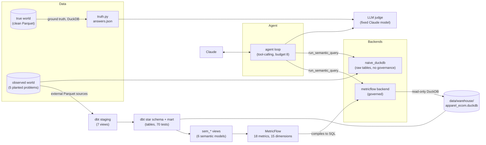
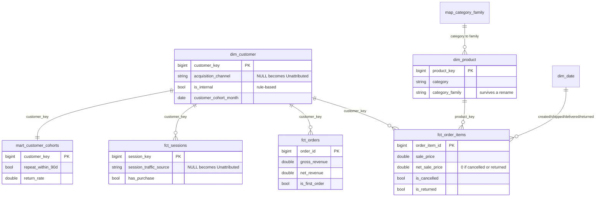
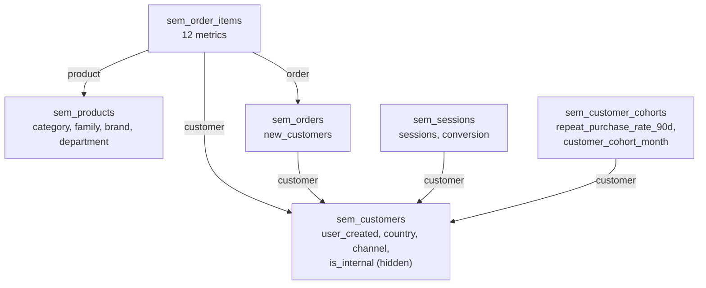

# Project 2: dbt Core + MetricFlow on DuckDB

**Part 2 of 3** in the Klarix Semantic AI Benchmark: a portfolio project that puts three
semantic-layer stacks (BigQuery + Cube Core, **dbt Core + MetricFlow**, Power BI) behind the same
LLM agent, on the same frozen, intentionally flawed dataset, and asks the same 20 business
questions of each.

> **Status, stated up front.** The stack is built and tested: the dbt project, the MetricFlow
> semantic layer, the agent backend, the naive baseline and all the tooling for the evaluation.
> **The paid agent evaluation was deliberately not run** (about $55 in API tokens, see
> [Eval runs: not executed](#eval-runs-not-executed)). So this case study reports what was
> measured (the layer's correctness against ground truth, the build, the engine parity) and
> contains **no agent pass rates for this stack**. Nothing below implies otherwise.

**Thesis:** a semantic layer makes metric answers *consistent*, but not necessarily *correct*.
The layer is only as correct as the judgment encoded into it.

## The question

Project 1 asked this of BigQuery + Cube Core. Project 2 asks it of the stack that most mid-sized
data teams in the DACH region already run: **dbt Core**, with metric definitions living in the same
repository, reviewed in the same pull requests and tested by the same CI as the transformation
code.

That is worth testing separately for three reasons:

1. **Where "governed" lives is different.** In dbt the governance is tests, documented models and
   metric YAML next to the SQL. In Cube it is a separate service with its own model files.
2. **The failure modes differ.** Each stack has its own way to get a metric subtly wrong, and some
   are visible only when you build the same thing twice (see [Two stacks](#two-stacks-same-benchmark)).
3. **It runs on a laptop.** DuckDB and dbt need no cloud account. The only paid part is the LLM.

## The setup

A frozen snapshot of Google's public `thelook_ecommerce` dataset (a fictitious clothing store) is
copied twice: a clean **true** version and an **observed** version with five planted data-quality
problems (P1 to P5, below). Ground truth is computed from the clean version with separate code,
never through dbt or MetricFlow. An agent answers 20 fixed questions against the *observed* data
through a backend; the benchmark scores the answers against truth.

The frozen data, the planted problems, the 20 questions, the scorers, the judge and the system
prompt are **identical to Project 1** and were not changed for this project (checked against a git
tag of Project 1's final state). That is what makes the stacks comparable.

| | Project 1 | **Project 2** |
|---|---|---|
| Warehouse | BigQuery (EU) | **DuckDB**, one local file |
| Transformation | SQL views applied by a script | **dbt Core** (`dbt-duckdb`) |
| Semantic layer | Cube Core | **MetricFlow** |
| Agent model | Gemini on Vertex AI | **Claude** (`claude-opus-5`) |
| Cloud cost to run the stack | BigQuery + Vertex AI | **none** (API tokens only) |

## Architecture



The agent never writes SQL. It calls `list_metrics`, `list_dimensions` and `run_semantic_query`
against a shared contract (`shared/semantic/catalog.yaml`: metrics and dimensions by name, a time
range, filters, a limit). MetricFlow compiles that into SQL; the backend runs it on its own
read-only DuckDB connection and renames the columns back to catalog names. The naive baseline
compiles the same contract into hand-written SQL on the raw tables.

## Star schema

The same model as Project 1, rebuilt in dbt: same grains, columns and business rules (the
BigQuery SQL was the reference implementation, ported rather than redesigned). Surrogate keys are
a deterministic hash instead of BigQuery's `FARM_FINGERPRINT`, so key *values* differ, but the
aggregates are identical (see [Results](#results-what-was-measured)).



`fct_orders` keeps fully cancelled orders as rows (`gross_revenue = 0`), so "how many orders" has
one unambiguous denominator. On top of the star schema sit six thin `sem_*` views, one per
MetricFlow semantic model. They exist because MetricFlow needs a real date column inside each
model, while the star schema stores only date keys; adding the dates there would have changed the
columns that were checked against Project 1.



## How each planted problem is handled

| # | Problem | Handled by design? | Where |
|---|---|---|---|
| **P1** | "Revenue" is ambiguous: gross includes returned items, net does not | Deliberately **not** resolved. Both metrics exist under separate names, so the test is whether the agent notices the split | `gross_revenue`, `net_revenue`; `sale_price` vs `net_sale_price` |
| **P2** | A category is renamed mid-window (Sweaters to Knitwear) | **Yes.** A hand-maintained dbt seed maps both names to one `category_family`; a test checks the seed against `settings.yaml` | `seeds/map_category_family.csv`, `category_family` dimension |
| **P3** | Consent loss nulls the acquisition channel and session source | **Visible, not fixable.** NULL becomes an explicit `Unattributed`, and `attribution_coverage_rate` exposes the gap. The true source is unrecoverable by design | `dim_customer`, `fct_sessions`, `attribution_coverage_rate` |
| **P4** | Synthetic internal/test accounts inflate order counts and distort repeat rate | **Yes, on the governed path only.** `is_internal` is a rule (email domain or name prefix) and every metric filters on it. A dbt test checks it flags exactly the injected number of users. `naive_duckdb` cannot exclude them | `dim_customer.is_internal`, a metric-level filter on every metric |
| **P5** | A real, small cohort returns far more items, invisible at whole-channel level | **Structurally.** A cohort mart exists so the question can be asked at cohort grain. The agent still has to choose to look there | `mart_customer_cohorts` |

## Governance in dbt

What dbt guarantees here, and where it stops:

- **Build-time guarantees (70 data tests).** Primary keys are unique and not null in every
  dimension and fact. Every foreign key resolves, including to the `-1` unknown member. The fact
  table has exactly the source's row count, and its gross revenue reconciles to the source within
  one cent. Every category has a family. The seed names match `settings.yaml`. The internal flag
  count equals the injected count. The `Unattributed` bucket exists and no NULL channels remain.
- **Documentation is part of the model.** Every model states its grain first, and every column
  has a description, so `dbt docs` is a usable data dictionary.
- **Internal-user exclusion is a convention, so it is enforced by a test.** MetricFlow has no
  model-wide default segment, so each metric carries its own `filter: is_internal = false` (Project
  1's Cube model uses the same per-measure convention). Nothing stops someone adding a metric
  without it, so a contract test walks the metric graph and fails if any catalog metric neither
  carries the filter nor is built only from metrics that do.
- **The agent sees exactly the catalog.** Metric and dimension descriptions are the catalog's
  text, copied verbatim and compared by a test. Helper metrics are marked `agent_facing: false`
  and never listed. A hygiene test checks that no agent-visible text names a planted problem or
  its parameters (see [Limitations](#honest-limitations) for the one place that fails in Project 1).

What dbt does **not** guarantee: that a definition is *right*. Every test above passes for a
`net_revenue` that quietly forgets to subtract returns. Correctness against an independent source
of truth is a different test, and it is the next section.

## Results: what was measured

All of this ran, offline and without an LLM, and is reproduced by the `make` targets at the end.

**1. The layer is correct against ground truth.** For every catalog metric, MetricFlow's answer
over the full 24-month window is compared with a number recomputed from the clean true world
(DuckDB, separate code). The same suite runs for Cube.

| | Checks | Largest deviation from truth | Tolerance |
|---|---|---|---|
| **MetricFlow** | 41 | `repeat_purchase_rate_90d` **0.22%**; every other check about **1e-14** (floating-point rounding) | 0.5% |
| Cube (Project 1) | 41 | `repeat_purchase_rate_90d` 0.22%, `orders` 0.077%, `purchasing_customers` 0.051%, the rest near exact | 0.5% |

Two notes. The repeat-rate gap is the same in both stacks and comes from the shared mart rule
("second order within 90 *calendar days*", so a same-day second order counts) versus truth's exact
timestamps (0.10188 against 0.10166). And MetricFlow is exact on `orders` and
`purchasing_customers` because the plan defined them on order items; Cube defines them on the
orders table and differs by a few zero-price orders.

**2. The build is deterministic and matches Project 1.** `make p2-build` runs 93 dbt nodes (1 seed,
13 views, 9 tables, 70 tests) green from an empty warehouse file in about five seconds. Two fresh
builds gave identical row counts and content fingerprints for the seed, staging views, star
schema and mart (checked when the star schema was built). Against Project 1's
BigQuery star schema, 44 aggregates (row counts, measure sums, date-key sums, flag counts) match
with **0 mismatches**.

| Table | Rows | Table | Rows |
|---|---|---|---|
| `fct_order_items` | 175,804 | `dim_customer` | 97,447 (1,000 internal) |
| `fct_orders` | 119,574 | `dim_product` | 30,858 |
| `fct_sessions` | 663,100 | `dim_date` | 2,829 |
| `mart_customer_cohorts` | 97,446 | `dim_distribution_center` | 11 |

**3. The naive baseline is the same baseline on a second engine.** `naive_bigquery` was refactored
into an engine-independent compiler with a small dialect object. Before touching it, the SQL it
generated for 20 fixed queries was captured; after the refactor all 20 are **byte-identical**.
Then the same 18 runnable queries run through `naive_duckdb` and `naive_bigquery` return the same
numbers (0 differences, up to a 149,197-row group-by). So "naive versus governed" means the same
thing in both case studies.

**4. One question, end to end (a smoke test, not a result).** "How many orders did we have last
month?" asked once of Claude on each backend. Ground truth is 4,633.

| Backend | Answer | What happened |
|---|---|---|
| `naive_duckdb` | **5,898** (+27%) | High confidence. No mention of internal accounts, which this backend cannot see or exclude |
| `metricflow` | **4,633** | Exact. The layer excludes internal and test accounts by construction, and the agent's stated definition says so |

This is one question asked once. It illustrates the mechanism; it is not evidence about pass rates.

## Eval runs: not executed

The harness for the full evaluation is built and tested, but **no Project 2 agent run was made**.
Each full run produces 60 answers (20 questions, 3 paraphrases each) and calls the Claude judge on
every one. Project 1's comparable runs cost about $15 (Claude) and $10 (Gemini) in agent tokens
alone, so the four planned runs come to roughly **$55** with judge calls. That was not worth
spending for a portfolio project, so the runs were not made and **this README reports no pass
rates, no cost and no latency for them**.

What exists so the runs can be made later, and what each piece is proven to do:

| Piece | Command | Proven by |
|---|---|---|
| Four planned runs | `make eval BACKEND=... PROVIDER=...` (see below) | Smoke test above; the runner registers both new backends |
| Tool budget as a parameter | `MAX_TOOL_CALLS=12` | Tests: default prompt byte-identical, a larger budget lets an agent finish what 8 cuts off |
| Pinned runs | `config/runs.yaml` | Tests: Project 1's `COMPARISON.md` regenerates identically; an unset or missing pin stops with a clear error, never falling back to a newer run |
| Comparison reports | `make compare PROJECT=2`, `make compare-cross` | Tests on synthetic runs: strict and paraphrase-level rates, the sensitivity run in its own section, the layer effect with the model held constant, baselines labelled as mixing model and engine |
| Failure analysis | `make failures RUN=runs/<dir>` | Tests, and validated on Project 1's real runs (below) |

The four runs: `naive_duckdb × anthropic` (baseline), `metricflow × anthropic` (headline),
`metricflow × gemini` (control, the same model as Project 1's headline, so it isolates the layer),
and `metricflow × anthropic` with `MAX_TOOL_CALLS=12` (a sensitivity run, never mixed into the
headline). After each finishes, set its directory in `config/runs.yaml` and run the compare
targets. Until then they report that the run "has not been published yet".

**The failure-analysis tool**, which writes a table for a human to correct, was checked for free on
Project 1's existing runs. On the `cube × claude` run it attributed 10 of 14 failed questions to
the tool budget, consistent with Project 1's own finding that Claude hit the 8-call limit in 21 of
60 answers. That is a Project 1 observation made with Project 2's tool, shown only to prove the
tool works.

## Two stacks, same benchmark

These come from building the same layer twice and from the layer-level tests. They are **not**
agent-evaluation findings.

- **MetricFlow combines metrics from different fact models; Cube could not.** `orders` (defined on
  items) and `new_customers` (defined on orders) answer in one query through the shared time
  axis. In Cube the same pair needed an internal alias and routing code, because Cube refuses to
  join two fact cubes even through one shared dimension.
- **MetricFlow was harder in the setup, easier in the joins.** It needs a time spine, a real date
  column inside each model (hence the `sem_*` views), and exactly one source for each dimension
  name. Joins, once the entities are declared, need no hand-written join paths.
- **Both stacks needed the same convention for internal users**, a per-metric filter, and both are
  only as safe as the test that enforces it.
- **A metric's own time axis can differ from the catalog's.** `repeat_purchase_rate_90d` is
  catalogued by signup date but aggregates by cohort month in both layers. The backend's time
  routing has to know that, and says so in a warning when a query uses the other axis.
- **Different definitions, same truth.** Defining `orders` on items versus on the orders table
  moves the answer by up to 0.08% against truth. Neither is wrong; the tests show which is exact.
- **Descriptions drift unless they are tested.** Project 1's Cube text was written separately from
  the catalog and drifted, and one description leaked a problem label to the agent. Here the
  catalog text is copied verbatim and a test compares it.
- **Cost and portability.** DuckDB plus dbt is free and runs offline; the BigQuery stack needs a
  cloud project, credentials and a container. For a team that already runs dbt, the second stack
  adds no new infrastructure.

## Engineering findings

Each was found while building, not from the documentation.

| Symptom | Cause and fix |
|---|---|
| `dbt parse` rejects the semantic model that the dbt docs show | In dbt-core 1.12.5 `agg_time_dimension` must sit next to `semantic_model:` at model level, not inside it. Moved it |
| `dbt parse` fails: "requires a time spine model" | MetricFlow needs a day-grain time spine. Derived it from `dim_date` so the date range has one definition |
| One YAML patch per dbt model, but the star tables already had one | Made every semantic model a thin `sem_*` view, which also supplies the real date column |
| A semantic-model column carries only one entity | The cohort model needs two on `customer_key` (its own primary and a foreign `customer`). Used `derived_semantics` for the second |
| `DATE()` on the Parquet timestamps depends on the machine's time zone in DuckDB (BigQuery is always UTC) | Cast to a naive UTC timestamp in staging, and pinned `TimeZone: UTC` in the profile |
| dbt-duckdb resolves a relative database path against the current directory | The wrapper passes an absolute path |
| dbt prefixes custom schemas with the target schema | Overrode `generate_schema_name` so schemas are plain `staging`, `star`, `marts` |
| `mf validate-configs` fails with "cannot use a string pattern on a bytes-like object" | Not a manifest problem: the CLI prints emoji, which crash under Windows' cp1252 when piped. Run it in UTF-8 mode |
| First 20 backend tests error with `'NoneType' object has no attribute '__dict__'` | A module loaded by file path must be put in `sys.modules` before it runs, or its `@dataclass` cannot resolve annotations |
| A strict `xfail` reported success while the test crashed | The collector crashed on an aliased include and the `xfail` swallowed it. Found only by listing the actual hits; the test now asserts it collected something |
| Truth in the layer test stopped at midnight on the last day | `BETWEEN start AND end` on timestamps dropped 31 August (about 0.14%), hidden by the 0.5% tolerance. Now an exclusive upper bound |
| `ANY_VALUE` and tied order timestamps are non-deterministic | Sessions have exactly one user and source, so `MIN`; 91 users have two orders at one instant, so an `order_id` tie-breaker. Rebuilds are now identical |
| MetricFlow renders where-clauses as Jinja | A filter value like `{{ ... }}` from an LLM would be evaluated. The backend rejects template characters, control characters, NaN and non-ISO dates, and doubles quotes |

## Honest limitations

- **The agent evaluation was not run** (above). This is the largest gap, and it means the case
  study cannot say whether MetricFlow helped an agent. It can say the layer is correct, which is
  the precondition.
- **If the runs are made later**, run 2's judge and agent will be the same model (`claude-opus-5`).
  The judge is held fixed for comparability, and a hand review of a sample of its verdicts should
  accompany the numbers.
- **One repeat per question** is planned, so run-to-run noise would be unmeasured.
- **DuckDB is single-node.** Nothing here says how MetricFlow behaves on a large warehouse.
- **P3 is unrecoverable by design.** The layer can only make the lost source visible.
- **Project 1 leaks a planted-problem label to the agent.** Its Cube description of
  `attribution_coverage_rate` says "P3 (consent-tracking loss)", and that text reached the agent in
  Project 1's runs. Project 1 is frozen, so it is not fixed; the hygiene test marks it as an
  expected failure with the reason. Project 2's descriptions pass.
- **The naive time filter drops most of the last day** (`created_at <= '2026-08-31'` compares a
  timestamp to midnight). It is identical in both naive backends and kept as is; it partly offsets
  the internal-account inflation in the smoke test.
- **MetricFlow's Python API is not declared stable** upstream, so versions are pinned exactly
  (dbt-core 1.12.5, dbt-duckdb 1.11.0, dbt-metricflow 0.15.0, metricflow 0.213.0, checked
  2026-10-06). Installing dbt-core also moves `protobuf` from 7 to 6; the Google and Anthropic
  libraries still work on 6.
- **License.** MetricFlow was AGPL up to 0.140.0, BSL from 0.150.0 to 0.208.2, and is Apache 2.0
  from 0.209.0 ([upstream README](https://github.com/dbt-labs/metricflow)); the pinned 0.213.0 is
  Apache 2.0, as are dbt-core and dbt-duckdb per their package metadata.

## Privacy

Everything runs locally except the LLM calls. The agent receives metric and dimension metadata
and aggregated query results only, never raw rows. Claude is called through the Anthropic API;
under Anthropic's commercial terms, API inputs and outputs are not used to train models by
default, and retention rules are in its
[API data-retention documentation](https://platform.claude.com/docs/en/manage-claude/api-and-data-retention)
(check the current wording before relying on it). The data is Google's public, synthetic
`thelook_ecommerce` dataset: no real customer data at any point.

## Reproduce it

The frozen snapshot (`data/`) is not in git, and re-pulling the public dataset would change the
numbers. These steps rebuild everything downstream of it.

```sh
make setup                  # uv sync, including the project2 dependency group
make world                  # true / observed / truth (deterministic from the seed)
make p2-build               # dbt: seed + staging + star + marts + 70 tests, fresh warehouse
make p2-mf-validate         # MetricFlow config validation (incl. warehouse checks)
make p2-layer-test          # contract, unit and layer-correctness tests for MetricFlow
make p2-docs                # dbt docs
make test                   # the whole suite (Cube tests skip unless `make cube-up`)

# Optional, need GCP credentials (a few cents of BigQuery scans):
make p2-parity              # DuckDB star schema vs Project 1's BigQuery star schema
make p2-naive-parity        # naive_duckdb vs naive_bigquery on 18 queries

# Costs a few cents of Anthropic tokens:
make p2-smoke               # one question, Claude, naive_duckdb and metricflow

# NOT run for this case study (about $55): the four evaluation runs
make eval BACKEND=naive_duckdb PROVIDER=anthropic
make eval BACKEND=metricflow  PROVIDER=anthropic
make eval BACKEND=metricflow  PROVIDER=gemini
make eval BACKEND=metricflow  PROVIDER=anthropic MAX_TOOL_CALLS=12   # sensitivity run
# then pin each run in config/runs.yaml and:
make compare PROJECT=2 && make compare-cross
```

## What to screen-record

1. `make p2-build`: `dbt build` going green, 93 nodes, from an empty warehouse.
2. `make p2-docs` and the dbt docs lineage graph (staging, star, `sem_*`).
3. A MetricFlow query and its compiled SQL:
   `uv run python project2-dbt-metricflow/run_mf.py query --metrics orders,new_customers --group-by metric_time__month`
   (two fact models in one query, which Cube could not do).
4. `make p2-layer-test`: the deviation summary at the bottom (about 1e-14 everywhere except the
   one explained 0.22%).
5. `make p2-smoke`: the same question answered by `naive_duckdb` (5,898) and `metricflow` (4,633).
6. The byte-identical proof: `uv run pytest tests/test_naive_sql_refactor.py -v`.
